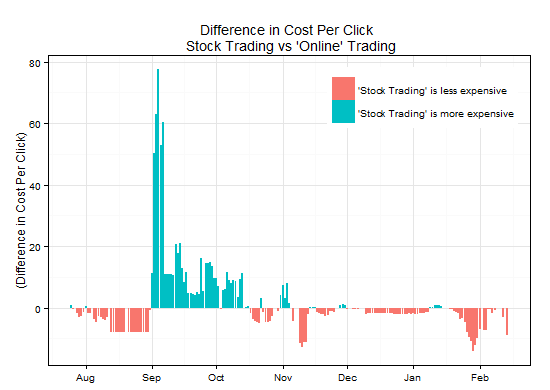

```{r echo=FALSE, warning=FALSE, message=FALSE}
knitr::opts_chunk$set(cache=TRUE)

  library("Rcell")
  library("lubridate")
  library("dplyr")
  library("doParallel")
  library("ggplot2")
  library("reshape2")
  library("TTR")
  library("pwr")
  library("xtable")

```

---
title: "Simple AB Testing of Search Keywords in R"
author: Alex Heaton
output: html_document
---
### Summary 
This is an example of AB testing of search keywords from the [open-advertising-dataset](https://code.google.com/p/open-advertising-dataset/). The source of this data is not identified but it seems to provide data on click and costs from Google AdWords bids in the UK. The data is broken up into 170 csv files one for each day-and there are about 100,000 individual records after all of the csv files are combined.

Here a visualization of the top 50 keywords in terms of the clicks. The color of the bar indicates the cost per click (CPC) with light blue bars getting 50-60 British Pounds per click. (This chart excludes the #1 search term "free" because it is so high it skews the chart.)

```{r echo=FALSE, warning=FALSE, message=FALSE}

  #Read all Files of keywords and merge into one dataframe
  file_list <- list.files("./csv")
  for (file in file_list){
    path = paste(getwd(),"/csv/",file,sep = "")
    searchDate <- ymd(substr(file, 19,26)) #parse the filename to get the date
    
      # if the merged dataset doesn't exist, create it
      if (!exists("dataset")){
        #These files are in a UNIX format that required me to read them this way
        filetext <- readLines(con <- file(path, encoding = "UCS-2LE"), n =752); close(con)
        dataset <- read.table(textConnection(filetext), header=TRUE, sep="\t")
        dataset$searchDate <- searchDate
    } else {
        filetext <- readLines(con <- file(path, encoding = "UCS-2LE"), n =752); close(con)
        temp_dataset <- read.table(textConnection(filetext), header=FALSE, sep="\t", skip = 1)
        temp_dataset$searchDate <- searchDate
        names(temp_dataset) <- names(dataset)
        dataset<-rbind(dataset, temp_dataset)
        rm(temp_dataset)
    }
  }

#Remove the collums we don't need and do other cleanup on the data
dataset <- select(dataset, Keyword,CPC=Average.CPC, Clicks, CTR, Cost, Impressions, searchDate)
abdata  <- filter(dataset, Keyword=="online trading" | Keyword=="stock trading")
abdata$CTR <- as.numeric(gsub("%", "", abdata$CTR))
abdata <- abdata[complete.cases(abdata),]
```

```{r, echo=FALSE, warning=FALSE, message=FALSE, fig.height=6, fig.width=8}

  totals <- dataset[complete.cases(dataset),]
  totals <- group_by(totals, Keyword)
  totals <- summarize(totals, Clicks = sum(Clicks), CPC = mean(CPC), CTR=mean(CTR))
  totals <- totals[-1,]
  
  top50 <- arrange(totals, desc(Clicks)) 
  top50 <- top50[2:50,]
  #Reorder the factor so it plots correctly
  top50 <- arrange(top50, Clicks)
  top50$Keyword <- revFactor(factor(top50$Keyword, levels = top50$Keyword))

ggplot(data=top50, aes(x=Keyword, y=Clicks/1000, fill=CPC)) +
  geom_bar(stat="identity") +
  ggtitle("Top  50 Search Keywords") +
  ylab("(Thousands of Clicks)") + xlab(NULL) +
  scale_y_sqrt("Clicks") +
  theme(axis.text.x=element_text(angle=90,hjust=1,vjust=0.5, size = 12))
```

###Defining the AB Test "online trading" or "stock trading"
Let's imagine that I am marketing manager for an online brokerage and I want to determine what keyword gives me the best cost per click "**online trading**" or "**stock trading**" (I picked these terms because they have very similar performance so statistical analysis is required to determine which one performs better.)

First let's load the data from the csv files and have a look:

```{r, echo=FALSE, warning=FALSE, message=FALSE, fig.height=3.5, fig.width=8}
print(abdata[9:10,])
```

###AB Test #1: Test Results from a Single Day
You can see in the table above that for each Keyword I have the CPC, Clicks, CTR, and Total Impression for each day. On this day, the two keywords had exactly the same CTR, so I cannot tell which one performs better. For my first AB test I will choose data from a different date which has more variance between the two keywords.

```{r, echo=FALSE, warning=FALSE, message=FALSE, fig.height=3.5, fig.width=8}
print(abdata[9:10,])
```

On this day "online trading" has a slightly higher CTR than "stock trading". But I need to do more analysis to determine if this is a meaningful difference. I will use a Chi-squared Test determine if "online trading" really performs better of if the difference is due to chance.

First I structure the data into a 2x2 table to prepare it for the t-test.

```{r, echo=FALSE, warning=FALSE, message=FALSE, fig.height=3.5, fig.width=8}

online.yes <-round(abdata[9,]$Clicks)
online.no  <-round(abdata[9,]$Impressions - abdata[1,]$Clicks)
stock.yes  <-round(abdata[10,]$Clicks)
stock.no   <-round(abdata[10,]$Impressions - abdata[1,]$Clicks)

Conversions <- as.table(rbind(c(online.yes, online.no ), c(stock.yes, stock.no)))
dimnames(Conversions) <- list(Keyword = c("a: online trading", "b: stock trading"),
                              Response = c("Click","NoClick"))
Conversions #Print the table
```

```{r, echo=FALSE, warning=FALSE, message=FALSE, fig.height=3.5, fig.width=8}
chisq.test(Conversions)
```

The key figure we need to check is the p-value. In general, if the p-value is less than 0.05 we can trust that there is a meaningful difference between the two groups. And we can reject the NULL hypothesis that the mean CTR of the two terms is the same.

In this case, the p-value is 0.845, which is very high. So I can't determine if any keyword is better than the other.

###AB Test #2: Test All Data
In order to decrease the p-value I need to test more data, across more than one day. So I am going to test the data from all 170 days.

```{r, echo=FALSE, warning=FALSE, message=FALSE, fig.height=3.5, fig.width=8}

#total up all of the data 
abdata.total <- group_by(abdata, Keyword)
abdata.total <- summarize(abdata.total, CPC=round(mean(CPC),2),Clicks=sum(Clicks), 
          Cost=sum(Cost), CTR=mean(CTR), Impressions=sum(Impressions))
print(abdata.total)
```

```{r, echo=FALSE,warning=FALSE, message=FALSE, fig.height=3.5, fig.width=8}

#prepare the table
online.yes <-round(sum(abdata[abdata.total$Keyword=="online trading",]$Clicks))
online.no  <-round(sum(abdata[abdata.total$Keyword=="online trading",]$Impressions) - sum(abdata.total[abdata.total$Keyword=="online trading",]$Clicks))
stock.yes  <-round(sum(abdata.total[abdata.total$Keyword=="stock trading",]$Clicks))
stock.no   <-round(sum(abdata.total[abdata.total$Keyword=="stock trading",]$Impressions) - sum(abdata[abdata.total$Keyword=="online stock",]$Clicks))

Conversions <- as.table(rbind(c(online.yes, online.no ), c(stock.yes, stock.no)))
dimnames(Conversions) <- list(Keyword = c("a: online trading", "b: stock trading"),
                              Response = c("Click","NoClick"))
#Conversions #Print the table
chisq.test(Conversions)

```

This time, with all the data, the p-value is practically zero so I feel confident that "online trading" is the better performing keyword--it has a higher click-through-rate and lower CPC.

So is this a good AB test? Actually no, it would have taken 6 months and 250K British Pounds to collect this much data. 

So the next step is to figure out the minimum number of days (sample size) that I need to run this test and get a significant result. 

###Determining the Best Sample Size

The technique to estimate the optimal, minimal size is called statistical power. Statistical power is the probability that a study will accurately detect the difference if there is an effect there to be detected. If statistical power is high, the probability of detecting the difference between the two groups go up. 

There are functions in R that can be used to calculate the optimal, minimum sample size for your experiment. The pwr.chisq.test takes the below inputs to recomend the n/nample size for your experiment. 

- w: This is the size of the differience you are trying to detect. In my case I estimate that the average CTR is 4.0% and I want to any of the words perform .5% better. I enter those values into the ES.w1 funtion and it returns a value of .025. 
- df: Degrees-of-freedom is calculated as (n of xaxis -1)*(n of yaxis-1). In this case we have a 2x2 table so the df works out to be one.
- sig.level is .05, consistent with our other p-value tests
- power, I set at .9, which we want to make sure or chance of detecting the effect is 90%.


```{r, echo=FALSE, warning=FALSE,  fig.height=3.5, fig.width=8}

W <- ES.w1(.04,.045) #output = 0.025
power <- pwr.chisq.test(w = W, df = 1, sig.level =.05, power = .9)
avgperday <- abdata.total$Impressions/170
N <- round(power$N)

```

Based on those inputs R estimates an N of 'r N', for each keyword. I will need to run the test for 10 days to collect that much data. So I pull in 10 days of data and do the Chi test. 

```{r, echo=FALSE, warning=FALSE, message=FALSE, fig.height=3.5, fig.width=8}

abdata <- abdata[1:20,]

#total up all of the data 
abdata.total <- group_by(abdata, Keyword)
abdata.total <- summarize(abdata.total, CPC=round(mean(CPC),2),Clicks=sum(Clicks), 
          Cost=sum(Cost), CTR=mean(CTR), Impressions=sum(Impressions))
print(abdata.total)

#prepare the table
online.yes <-round(sum(abdata[abdata.total$Keyword=="online trading",]$Clicks))
online.no  <-round(sum(abdata[abdata.total$Keyword=="online trading",]$Impressions) - sum(abdata.total[abdata.total$Keyword=="online trading",]$Clicks))
stock.yes  <-round(sum(abdata.total[abdata.total$Keyword=="stock trading",]$Clicks))
stock.no   <-round(sum(abdata.total[abdata.total$Keyword=="stock trading",]$Impressions) - sum(abdata[abdata.total$Keyword=="online stock",]$Clicks))

Conversions <- as.table(rbind(c(online.yes, online.no ), c(stock.yes, stock.no)))
dimnames(Conversions) <- list(Keyword = c("a: online trading", "b: stock trading"),
                              Response = c("Click","NoClick"))
#Conversions #Print the table
chisq.test(Conversions)

```

As we expected, the p-value of the t-test is 0.04447, which means we accept that "online trading" has the higher click-through rate.

So I should pick "online trading" right? Remember my goal is to find the keyword with the lowest CPC. And "stock trading" actually has the lowest CPC with 6.59.

But before I pick "stock trading" I want to do one more test. I want to know if the differences in the CPC are really statistically significant. I will use another kind of test called the t-test to test the means of the CPC for those 10 days.


```{r, echo=FALSE, warning=FALSE, message=FALSE, fig.height=3.5, fig.width=8}

online.cpc <- abdata[c(1,3,5,7,9,11,13,15,17,19),]$CPC
stock.CPC <- abdata[c(2,4,6,8,10,12,14,16,18,20),]$CPC

t.test(online.cpc,stock.CPC)
```

The p-value is very low (0.01) and furthermore the confidence interval is 0.30 - 2.07. Meaning that we have at least 95% confidene that the difference between the two keywords is not zero and is between .3 and 2.

##Conclusion 
So I chose "stock trading" as the keyword for my campaign.

After all that, did I make the right choice? Well, when I calculated the CPC for all of the data above "online trading" actually had the lowest CPC (12.29 vs 13.59 for online trading). Let's visual the data to see what is going on. This chart shows the difference between the price of the two keywords. 

```{r, echo=FALSE, warning=FALSE, message=FALSE}

 online.df <- abdata[abdata$Keyword=="online trading",]
 stock.df <- abdata[abdata$Keyword=="stock trading",]
 
p <- ggplot(data=stock.df, aes(x=searchDate, y=CPC-online.df$CPC, fill = ifelse(CPC-online.df$CPC <0, "'Stock Trading' is less expensive", "'Stock Trading' is more expensive"))) +
  geom_bar(stat="identity")  + 
  theme(legend.justification=c(1,1), legend.position=c(1,1))+
ggtitle("Difference in Cost Per Click \n Stock Trading vs 'Online' Trading") +
  guides(fill=guide_legend(title=NULL)) +
  ylab("(Difference in Cost Per Click)") + xlab(NULL)

```


For most months Stock Trading is the least expensive keyword. But in September, the price of Stock Trading spikes which is why it is more expensive on average for the whole time period.

Since the relative price of the keywords is constantly changing, the best strategy is not to pi ck one keyword, no matter how much you test it. But rather to continuually monitor and optimize your bids to make sure that you are making the smartest choices.
